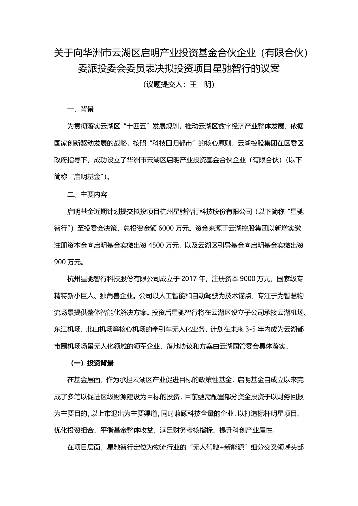
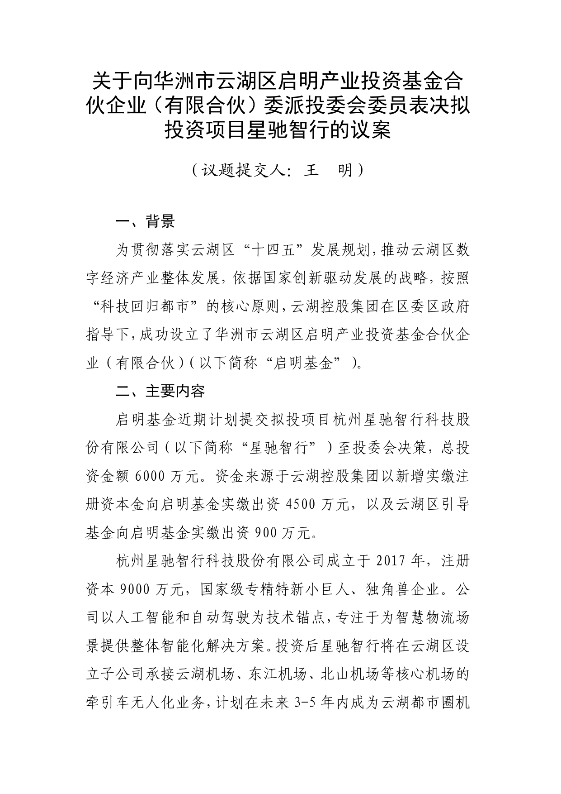
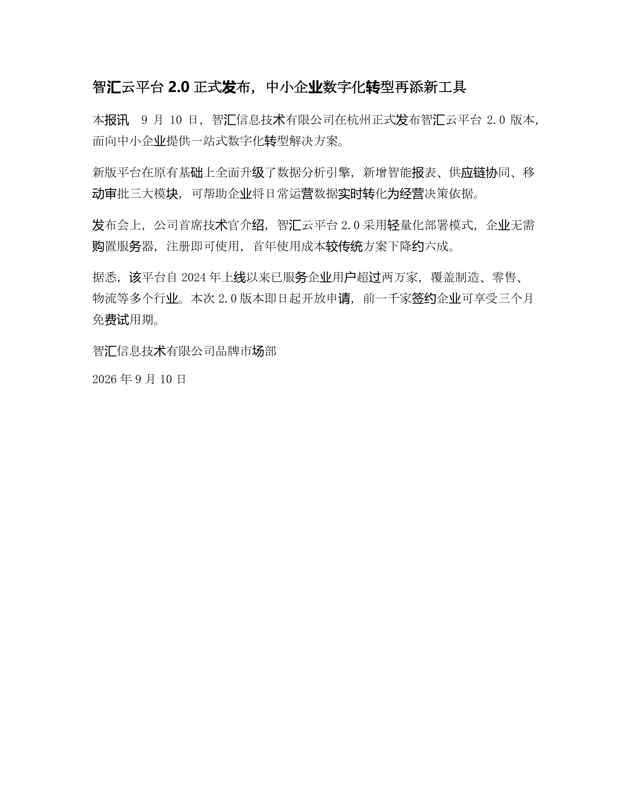
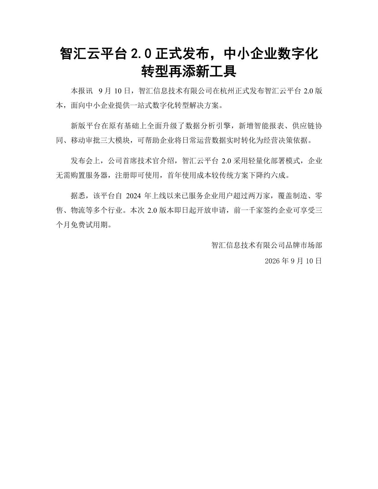

# format-agent-skill

**中文 | [English](README_EN.md)**

「最终版」通用文档格式排版 Agent Skill（黑客松演示名称）。**理解归 AI，动手归代码，中间用 JSON 交接。**

给它一份格式规范（自然语言规范文字，或排好版的 Word 模板）加一份格式混乱的 docx，
Agent 自主完成理解规范、识别文档结构、逐段改写格式，输出可直接交付的 Word 文档。

> 本仓库即为 Skill 本体：`SKILL.md` 在根目录，clone/下载整个仓库即可安装。

## 安装（对你的 Agent 说一句话）

```
帮我安装这个 skill：https://github.com/KaguraNanaga/format-agent-skill
```

Agent 会读取 `SKILL.md`，自行完成安全审计、依赖安装与冒烟测试。

- 支持 Skill 机制的 Agent 环境均可使用：Kimi Code、腾讯 WorkBuddy、字节 Trae、阿里 Qoder、百度 Comate 等
- 私有仓库克隆卡住时，用已登录的 gh CLI：`gh repo clone KaguraNanaga/format-agent-skill`
- 手动安装：把本仓库整个目录复制到 Agent 的技能目录（如 `~/.workbuddy/skills/format-agent/`）

## 使用

安装后，对 Agent 直接描述任务即可，例如：

> 按《规范文字.txt》的要求，把"待排版.docx"重排一下。

> 参照这份党委会议题模板，把这份汇报材料排成正式格式。

**已实测验证**：在 Kimi Code 里安装本 skill 后，直接给它"一份排版好的文档 +
一份待排版文档"，Agent 即可完成格式克隆——把模板文档的字体、字号、行距、
缩进、编号体例完整迁移到目标文档，并产出修订稿与对照报告。

也可以用命令行直接运行（本仓库根目录）：

```bash
pip install -r requirements.txt

# 规范文字作为格式来源
python main.py --spec examples/spec.txt --target examples/messy.docx --out out/排版后.docx

# Word 模板作为格式来源
python main.py --template "examples/模板-党委会议题样表.docx" --target examples/messy.docx --out out/排版后.docx

# 排版后再做一轮视觉自检（需多模态模型）
python main.py --spec examples/spec.txt --target examples/messy.docx --out out/排版后.docx --verify
```

## 输出产物

- `排版后.docx` —— 命名样式写入的干净稿（Word 里可继续编辑）
- `排版后_tracked.docx` —— 修订模式：Word 审阅视图逐条接受/拒绝每处格式改动
- `排版后_report.docx` / `.md` —— 段落级修改对照报告
- `_formatspec.json` / `_rolemap.json` —— Agent 理解规范的中间产物

## 实现原理

```
格式来源（规范文字 / 已排版的 Word 模板）
        │  ① 规则理解（宿主 Agent / LLM / 确定性读取）
        ▼
   FormatSpec（格式规则 JSON）◄── Schema 校验，失败回喂自我修正
        │
目标 docx ── ② 结构抽取（python-docx，含编号元数据）──► 段落清单
        │                                                    │
        │        ③ 角色标注（编号惯例确定性识别 + 模型语义兜底）
        │                                                    ▼
        │                                             RoleMap（段落角色 JSON）
        ▼                                                    │
  ④ 执行器（确定性代码，写入 Word 命名样式）◄────────────────┘
        │
        ▼
干净稿 + 修订模式稿 + 修改对照报告 + （可选）视觉自检
```

- **模型只产出两个 JSON，永远不直接改 docx**：理解的质量取决于模型，落地的正确性取决于代码，排版零幻觉
- **规则随输入走，不内置任何文体知识**：各学校论文规范、各公司模板、各地区新闻稿，
  系统不预设"它们应该长什么样"，而是当场从用户给的规范或模板里读出来
- **结构识别三层策略**：高频惯例（一、（一）、第 X 条、Word 自动编号）走确定性规则；
  模板自带角色定义；长尾文体靠模型语义兜底
- **格式写入 Word 命名样式**，不是刷死的直接格式，输出文档可继续正常编辑
- **修订模式**记录每处格式改动（w:pPrChange / w:rPrChange），人在审阅视图里有最终否决权

## 案例与边界值

| 场景 | 说明 | 改前 | 改后 |
|---|---|---|---|
| 党委会议题议案 | 已排版模板 → 自动编号议案（模板格式克隆） |  |  |
| 课程论文 | 规范文字 → 三级序号论文 |  |  |
| 新闻稿 | 规范文字 → 无结构新闻稿 |  |  |

更多案例（项目周报等）见归档仓库的 `assets/demo/`。

**适用**：以段落为主的文书——党委会/股东会/董事会材料、合同、法律意见书、
咨询报告、论文、新闻稿、通知、方案。

**不适用**（当前版本）：以表格为主体的文档（花名册、报价单——表格内容会保留
原样不动）、封面页设计。这些部分保持原样，不会被改坏。

## 高级：独立 API 模式（可选）

在 Agent 环境里使用**无需任何模型配置**——理解工作由宿主 Agent 完成。
只有在没有 Agent 的环境（服务器、定时任务、本地裸跑）才需要自配模型：
复制 `.env.example` 为 `.env`，填入 OpenAI 兼容端点的
`LLM_BASE_URL` / `LLM_API_KEY` / `LLM_MODEL`。
建议多模态模型（支持图像输入，如 GPT-4o、Kimi K3、Qwen-VL、GLM-4V）——
排版主流程只需文本能力，但视觉自检要把渲染图交给模型质检。

完全不配模型也能跑：直接提供 FormatSpec / RoleMap JSON 走确定性降级链路
（`python main.py --spec-json ... --rolemap-json ...`）。

## 相关

- 黑客松完整版（GUI 演示界面、四象限案例、路演页）：
  [format-agent-01](https://github.com/KaguraNanaga/format-agent-01)（已归档）
